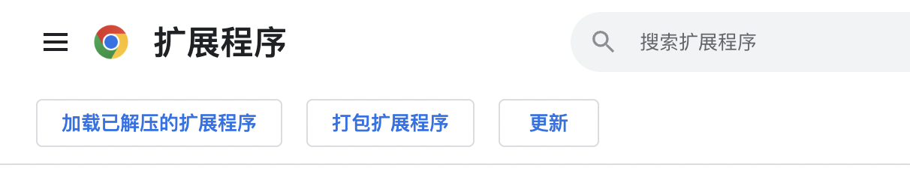
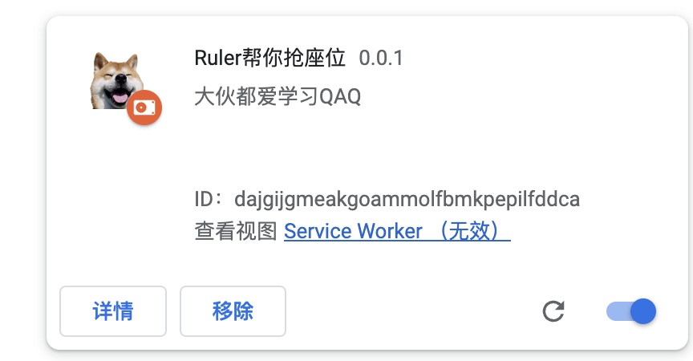
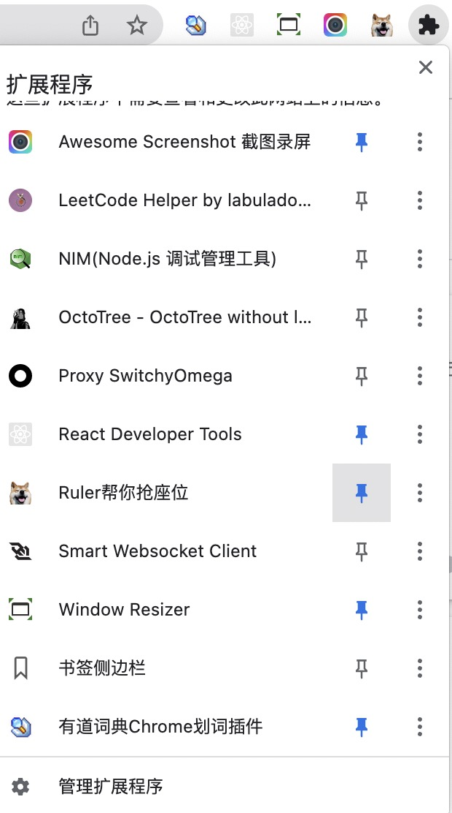
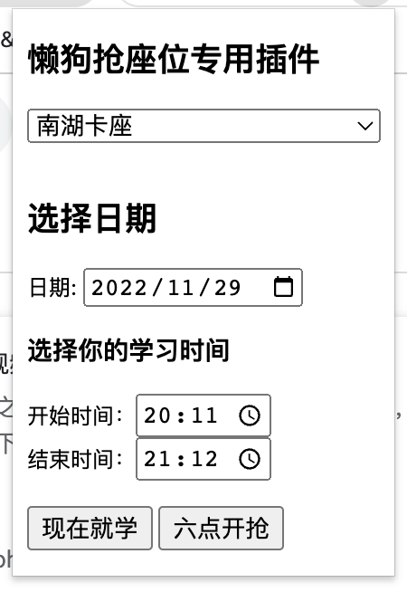

# 欢迎大家使用我的插件👏

欢迎大家加入群聊(如果可以的话打赏完了再进也行QAQ)

 

### 如何添加到扩展程序

通过 git clone 下载代码后 进入扩展页面，选择加载已解压的扩展程序，然后选择刚刚下载好的 extensions 文件夹

选中后出现下图的情况说明加载完成

### 使用方法

先如下图把插件固定在导航栏

然后点击狗头出现下图，就可以愉快的抢座位啦
注意⚠️ 一定要在http://kjyy.ccnu.edu.cn/ClientWeb/xcus/ic2/Default.aspx

这个网页下进行操作，在其他网页进行操作是不起作用的

**注意**

+ 现在就学，指临时抢座位，一般日期选择现在就行了
+ 六点开抢，用于六点钟抢第二天的座位，建议提前5-20分钟（过早可能会导致身份过期，抢座位失败）进入登陆页面，点击六点开抢，注意要把日期选择调整为第二天，然后就可以去刷刷视频啥的等待就行，大家可以 打开控制台(F12)或者鼠标右键进入开发者模式查看抢座位的结果

# 最后 

大哥大姐们打赏打赏吧QAQ 以后会写更多的便利小工具的

